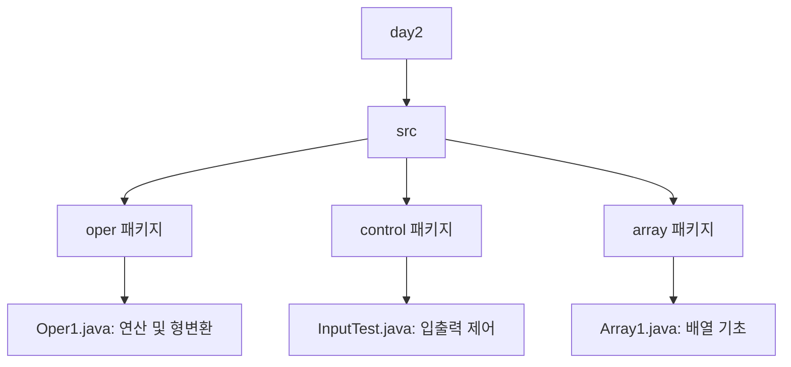

# ☕ Java Basic Learning - Day 2

Java 프로그래밍 기초 2일차 학습 내용 정리입니다. 연산자, 형변환, 입력(Scanner), 그리고 배열의 기초를 다룹니다.


- 아스키코드(ASCII, AMERICAN STANDADARD CHARACTOR....) --> UNICODE에 포함
  
- 8비트로 표현될 수 있는 정수값의 범위, 자바


```
2의 0승 - 1
2의 1승 - 2
2의 2승 - 4
2의 3승 - 8
2의 4승 - 16
2의 5승 - 32
2의 6승 - 64


2¹ = 2
2² = 4
2³ = 8
2⁴ = 16
2⁵ = 32
2⁶ = 64
총합 = 1 + 2 + 4 + 8 + 16 + 32 + 64 = 127

맨 앞 비트는 부호비트(1, 0)

맨 앞 비트 (최상위 비트, MSB) 가 부호를 결정
0이면 → 양수 (Positive)
1이면 → 음수 (Negative)


```


- jdk download
  jdk17 download(windows) - https://jdk.java.net/java-se-ri/17
- 컴파일+실행


- 패키지 만들기


- 한국어 언어팩 삭제(영어로 사용하고자 하는 경우)


- 코드리포맷(코드정리) - reformat(한글로) ==> 에러 없을 때만 코드정리해줌.


- new(한글로) --> 변경하지 말고 alt + insert를 그대로 쓰시기를 권장
- 영문버전으로는 키를 변경하는 것이 적용이 되는데 한글로는 적용이 되지 않음.


```
package test;

//자바파일하나 == class
//class이름은 파일명과 동일해야함.
//파일이름은 무조건 대문자로 시작
//낙타표기법
//클래스 첫줄은 무조건 패키지이름
//문장의 끝은 무조건 ;을 붙여야함.
public class Primitive {
    public static void main(String[] args) {
        //기본형 4가지
        //변수하나에 값하나 저장됨.
        //정수, 실수, 문자1, 논리
        //정수
        int age = 100; //정적타입핑, 정수말고는 다른 것 넣으면 에러
        //실수
        double height = 122.2; //소수점 15자리까지
        //문자1
        char gender = '남'; //무조건 홑따옴표
        //논리
        boolean food = true; //false

        //주의점.
        //정수는 byte --> short --> int --> long
        long money = 3333333333L; //L, l
        //실수는 float --> double
        float weight = 88.8F;
        //88.80000000000000 처럼 인식함.

        //추가
        //사람은 문자1글자보다 문자를 여러개를 많이 씀(문자열)
        String name = "홍길동"; //이중따옴표를 써야함.

        System.out.println("나이는 " + age + "세");
        System.out.println("성별은 " + gender + "임");
    }
}

```


  


## 📂 프로젝트 구조



---

## 📝 주요 학습 내용

### 1. 연산 및 형변환 (Casting)
`Oper1.java`에서는 기본적인 산술 연산과 데이터 타입 간의 변환을 학습합니다.

- **자동 형변환 (Promotion):** 작은 타입에서 큰 타입으로 변환될 때 자동으로 발생합니다. (예: `byte` -> `int` -> `double`)
- **강제 형변환 (Casting):** 큰 타입에서 작은 타입으로 변환할 때 데이터 손실을 감수하고 명시적으로 변환합니다. `(type)` 연산자를 사용합니다.
- **정수 연산의 특징:** 자바에서 `int` 간의 나눗셈 결과는 항상 `int`입니다. 실수 결과를 얻으려면 피연산자 중 하나를 `double`로 형변환해야 합니다.

### 2. 입출력 (Input/Output)
`InputTest.java`에서는 사용자로부터 입력을 받는 방법을 학습합니다.

- **System.out:** 표준 출력 장치 (모니터)
- **System.in:** 표준 입력 장치 (키보드)
- **Scanner 클래스:** `java.util.Scanner`를 사용하여 키보드 입력을 쉽게 처리할 수 있습니다.
  - `nextLine()`: 사용자로부터 한 줄의 문자열을 입력받습니다.
  - 모든 입력 데이터는 기본적으로 **문자열(String)** 타입으로 들어옵니다.

### 3. 배열 기초 (Array)
`Array1.java`에서는 데이터를 그룹으로 묶어 관리하는 배열을 다룹니다.

- **배열 선언 및 생성:** `int[] x = new int[10];`
- **참조형 변수:** 배열 변수 `x`를 출력하면 실제 값이 아닌 메모리 주소가 출력됩니다.
- **배열 길이:** `x.length`를 통해 배열의 크기를 확인할 수 있습니다.

---

## 🚀 실행 방법

각 Java 파일을 컴파일한 후 실행합니다.

```bash
# 예시: Oper1 실행
javac src/oper/Oper1.java
java -cp src oper.Oper1
```

