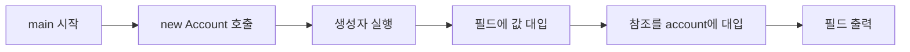
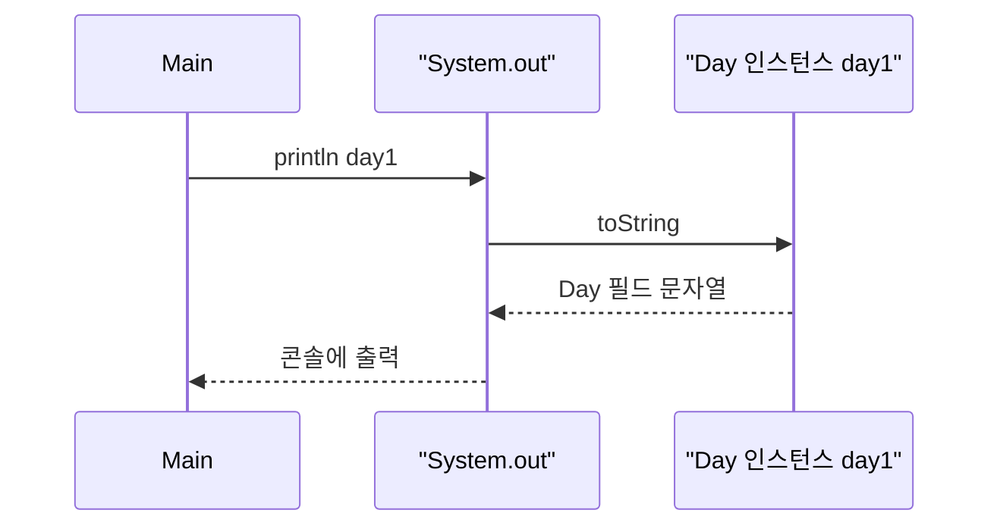
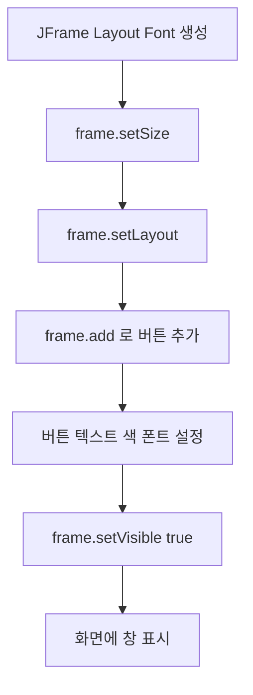
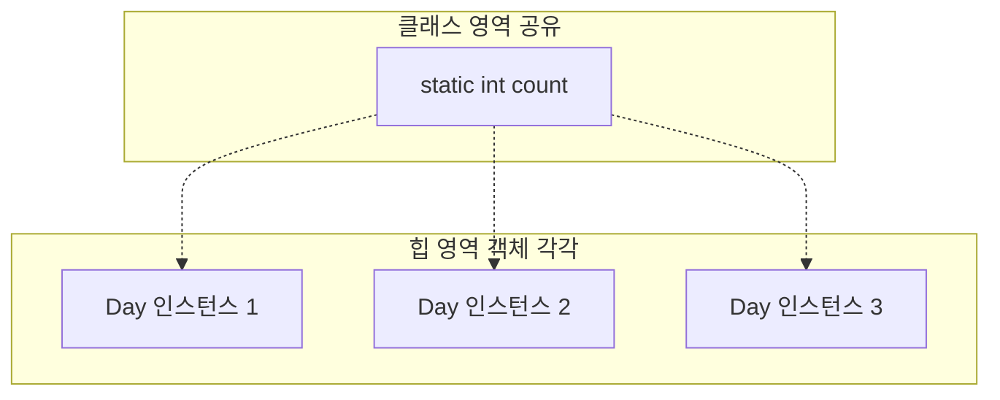

# ☕ Java Basic Learning - Day 5 (생성자 · static · Swing 입문)

## 📚 개요

이 수업에서는 **객체 생성 시 초기화(생성자)**, **클래스 공유 데이터(static)**, 그리고 **간단한 GUI(JFrame, JButton)** 를 다룹니다.

| 주제 | 내용 |
|------|------|
| **생성자(Constructor)** | `new`로 객체를 만들 때 자동 호출되어 필드를 원하는 값으로 초기화 |
| **static** | 인스턴스가 아니라 **클래스에 딱 하나** 존재하는 변수·메서드 |
| **toString()** | `System.out.println(참조변수)` 시 보이는 문자열을 직접 정의 |
| **Swing 기초** | `JFrame`, `FlowLayout`, `JButton`, `Font`, `Color` |

---

## 🔗 파일 구조

```
day5-static/
├── src/
│   └── object/
│       ├── Account.java      # 생성자로 계좌 정보 초기화
│       ├── AccountUse.java   # Account 사용 예제
│       ├── Day.java          # 인스턴스 필드 + static count + getter/setter
│       ├── DayUse.java       # Day 생성 및 static/toString 실습
│       └── Graphic.java      # JFrame + 버튼 GUI 예제
└── README.md
```

---

## 1️⃣ 생성자(Constructor) — `Account.java` / `AccountUse.java`

### 개념

- **생성자**는 클래스 이름과 같고, **반환 타입이 없습니다** (`void`도 쓰지 않음).
- 개발자가 생성자를 **하나도 작성하지 않으면**, 컴파일러가 **기본 생성자 `Account()`** 를 넣어 줍니다.
- **필드를 초기화하는 생성자**를 직접 만들면, 그 시그니처에 맞게 `new Account(이름, 주민, 금액)` 처럼 호출합니다.

### 메모리 관계 (도식)

```text
        STACK                         HEAP
  ┌──────────────┐              ┌─────────────────────┐
  │ account ─────┼─────────────►│ Account 인스턴스     │
  │ (참조/주소)   │              │ name: "홍길동"      │
  └──────────────┘              │ ssn:  "010115"      │
                                │ money: 10000        │
                                └─────────────────────┘
```


### 코드: `Account.java`

```java
package object;

public class Account {

    // 계좌만들때 필요한 필드(멤버변수)
    String name; //이름
    String ssn; //주민번호
    int money; //금액

    Account(String name,
                   String ssn,
                   int money) {
        this.name = name;
        this.ssn = ssn;
        this.money = money;
    }

//메서드는 만들지 않음.
}
```

### 코드: `AccountUse.java`

```java
package object;

public class AccountUse {
    public static void main(String[] args) {
        Account account = new Account(
                "홍길동",
                "010115",
                10000);
        //Account클래스내에 생성자가 하나도
        //없을 때 컴파일할 때
        //Account() 생성자메서드를 추가해줌.
        System.out.println(account.name);
        System.out.println(account.ssn);
        System.out.println(account.money);
    }
}
```

### 실행 흐름 (그림: mermaid)



---

## 2️⃣ static과 인스턴스 — `Day.java` / `DayUse.java`

### 개념

| 구분 | 설명 | 예시 (`Day`) |
|------|------|----------------|
| **인스턴스 변수** | 객체마다 힙에 **복사** | `doing`, `time`, `location` |
| **static 변수** | 클래스당 **한 번만** (공유) | `count` — 생성될 때마다 증가 |
| **static 메서드** | 객체 없이 `클래스이름.메서드()` | `Day.getCount()` |

**주의:** `static` 메서드 안에서는 **인스턴스 필드**에 바로 접근할 수 없습니다. (객체가 없을 수도 있기 때문입니다.)

### 인스턴스 vs static (도형: ASCII)

```text
                    ┌─────────────────────────────────────┐
  Method Area       │  Day 클래스                          │
  (클래스 영역)      │  ─────────────────                  │
                    │  static int count  ◄── 전 객체 공유   │
                    └─────────────────────────────────────┘
                                      │
          각 객체(day1, day2, day3)    │
                    ┌───────────────────┼───────────────────┐
        HEAP        │                   │                   │
                    ▼                   ▼                   ▼
              ┌──────────┐        ┌──────────┐      ┌──────────┐
              │ Day #1   │        │ Day #2   │      │ Day #3   │
              │ doing    │        │ doing    │      │ doing    │
              │ time     │        │ time     │      │ time     │
              │ location │        │ location │      │ location │
              └──────────┘        └──────────┘      └──────────┘
```

### 코드: `Day.java`

```java
package object;

public class Day {
    //인스턴스 변수
    //객체생성시 힙영역에 복사
    private String doing;
    private int time;
    private String location;
    //정적 변수, static변수
    //메모리 원본 영역에 한 개만 존재
    static int count;

    public Day(String doing, int time, String location) {
        //this는 이 클래스로 만든 객체
        this.doing = doing;
        this.time = time;
        this.location = location;
        count++; //누적용
    } //생성자

    //내가 만드는 메서드는 가운데에 넣는 편
    //객체 만들지 않고도 클래스이름으로
    //바로 접근해서 메서드를 호출하고 싶을 때
    public static int getCount(){
        //static만들 때 조심할 것
        //인스턴스 변수를 넣을 수 없음.
        //static 변수만 넣을 수 있음.
        return count;
    }

    public String getDoing() {
        return doing;
    }

    public void setDoing(String doing) {
        this.doing = doing;
    }

    public int getTime() {
        return time;
    }

    public void setTime(int time) {
        this.time = time;
    }

    public String getLocation() {
        return location;
    }

    public void setLocation(String location) {
        this.location = location;
    }

    public static void setCount(int count) {
        Day.count = count;
    }

    //toString()을 수정해서 재정의하자.
    @Override
    public String toString() {
        return "Day{" +
                "doing='" + doing + '\'' +
                ", time=" + time +
                ", location='" + location + '\'' +
                '}';
    }
} //클래스
```

### 코드: `DayUse.java`

```java
package object;

public class DayUse {
    public static void main(String[] args) {
        Day day1 = new Day("자바코드", 4, "세종대");
        System.out.println(day1); //참조형 변수
        System.out.println(Day.count);
        Day day2 = new Day("상속", 4, "세종대");
        System.out.println(day2);
        System.out.println(Day.count);
        Day day3 = new Day("인터페이스", 4, "세종대");
        System.out.println(day3);
        System.out.println(Day.count);

        System.out.println(Day.getCount());

        System.out.println(day1.getDoing());
        //참조형 변수를 출력해보니 패키지명.클래스명@주소 문자열 형태로 프린트됨.
        //이 문자열을 만들어주는 메서드가 자동호출하게 되어있음.
        //toString()임. 이것을 수정하면 변수가 가르키는 인스턴스 변수들을 출력하게 할 수 있음.
//        System.out.println(day1.doing);
//        System.out.println(day1.time);
//        System.out.println(day1.location);
    }
}
```

### `toString()` 동작 (그림: mermaid 시퀀스)



---

## 3️⃣ Swing GUI 입문 — `Graphic.java`

### 개념

- **`JFrame`**: 창(틀). 크기 `setSize`, 보이기 `setVisible(true)` 가 필요합니다.
- **`FlowLayout`**: 컴포넌트를 **왼쪽부터** 나열합니다.
- **`JButton`**: 버튼. `setText`, `setBackground`, `setFont` 등으로 꾸밉니다.
- **`Color.xxx`, `Font.BOLD`** 처럼 자주 쓰는 값은 **클래스 이름으로 접근** — 수업에서 배운 **static** 과 같은 맥락입니다.

### 화면 구성 스케치 (도형)

```text
   ┌────────────────────────────────────────────┐
   │  나의 첫 자바프로그램 (JFrame 제목)          │
   ├────────────────────────────────────────────┤
   │  [ 버튼1 ] [ 버튼2 ] [ 버튼3 ] [ 버튼4 ] [ 버튼5 ]   ← FlowLayout
   │     ↑ 색/글꼴 설정                            │
   └────────────────────────────────────────────┘
```

### 코드: `Graphic.java`


```java
package object;

//컴파일러가 번역할 때 자동으로 넣어줌.
//개발자는 써주지 않음.
//import java.lang.*;

import javax.swing.*;
import java.awt.*;

public class Graphic {
    public static void main(String[] args) {
        //필요한 부품들을 생각해보자.
        //틀 --> JFrame
        //배치 --> FlowLayout
        //버튼 --> JButton
        //글자 --> Font

        //JFrame클래스로 객체를 만들어주세요.
        //new --> 객체생성과 관련된 키워드
        JFrame frame = new JFrame("나의 첫 자바프로그램"); //힙영역에 멤버변수들을 복사
        FlowLayout layout = new FlowLayout();
        JButton button = new JButton();
        JButton button2 = new JButton();
        JButton button3 = new JButton();
        JButton button4 = new JButton();
        //객체생성시 멤버변수들을 내가 원하는 값으로 초기화하고 하고 싶은 경우
        //"클래스이름과 동일한 메서드"를 만들어서 객체생성과 동시에
        //초기화가 가능함. ==> 생성자 메서드(생성자, CONSTRUCTOR)
        //객체 생성시 클래스이름과 동일한 메서드인 생성자 메서드가 있으면
        //자동 호출되면서 멤버변수 자동 초기화
        Font font = new Font("궁서", Font.BOLD, 30);

        //프레임은 가로/세로 설정이 꼭 있어야한다.
        frame.setSize(400,400);
//        frame.setTitle("나의 첫 자바프로그램");
        //프레임에 레이아웃 설정
        frame.setLayout(layout); //왼쪽부터 붙이고, 가운데 정렬
        frame.add(button);
        frame.add(button2);
        frame.add(button3);
        frame.add(button4);
        frame.add(new JButton("버튼5")); //ok
        //버튼5를 담고 있는 변수가 없어서 버튼안에 있는 메서드나 변수를 접근 불가능

        button.setText("버튼1");
        button2.setText("버튼2");
        button3.setText("버튼3");
        button4.setText("버튼4");

        //프로그램할 때 자주쓰는 변수(보통 상수)나 메서드는
        //클래스이름으로 바로 접근해서 사용 가능하게 만들어놓았음.
        //Color.pink, Font.BOLD, Math.PI
        //Math.random(), Integer.parseInt() : String("100") --> int(100)
        //Float.parseFloat(), Double.parseDouble()
        //String.valueOf() : int(100) --> String("100")
        //메모리에 항상 상주하고 있어서 클래스이름으로 접근/불러서 사용 가능함
        //static(정적) 변수/메서드
        button.setBackground(Color.CYAN);
        button2.setBackground(Color.pink);
        button3.setBackground(Color.yellow);
        button4.setBackground(Color.ORANGE);


        button.setFont(font);
        button2.setFont(font);
        button3.setFont(font);
        button4.setFont(font);

        //프레임은 위 설정에 맞게 보여지게 해야함.
        //기본값은 보이는 것으로 설정을 바꾸어주어야함.
        //맨 마지막에 써야함.
        frame.setVisible(true);
    }
}
```

### GUI 초기화 흐름 (그림: mermaid)



---

## 🎓 핵심 요약

| 주제 | 기억할 점 |
|------|-----------|
| **생성자** | 클래스명과 동일, 반환 타입 없음, `new` 시 자동 호출 |
| **static 변수** | 모든 인스턴스가 **공유**, 생성자 등에서 누적 카운트에 적합 |
| **static 메서드** | 인스턴스 필드 사용 불가(원칙적으로) |
| **toString()** | `println(객체)` 시 사용 — 내용을 읽기 좋게 바꿀 수 있음 |
| **Swing** | `JFrame` + `Layout` + 컴포넌트 추가 후 `setVisible(true)` |

---

## ▶️ 실행 방법 (IntelliJ / 터미널)

- **AccountUse**: `object.AccountUse` 의 `main` 실행  
- **DayUse**: `object.DayUse` 의 `main` 실행  
- **Graphic**: `object.Graphic` 의 `main` 실행 (GUI 창이 뜸)

터미널 예시 (`day5-static` 기준, 소스 경로에 맞게 조정):

```bash
javac -d out src/object/*.java
java -cp out object.AccountUse
java -cp out object.DayUse
java -cp out object.Graphic
```

---

## 📎 참고 그림 (개념 한눈에)

아래는 **static 필드가 “클래스에 붙어 있는 공유 값”** 이라는 점을 시각화한 다이어그램입니다.



<hr>

<br>
- 클래스 & 객체 복습


<br><br>
- 생성자


<br><br>
- static


<br><br>
- final(상수 설정)


<br><br>
- getter/setter


<br><br>
-접근 제어자


<br><br>
- 가변길이 매개변수


